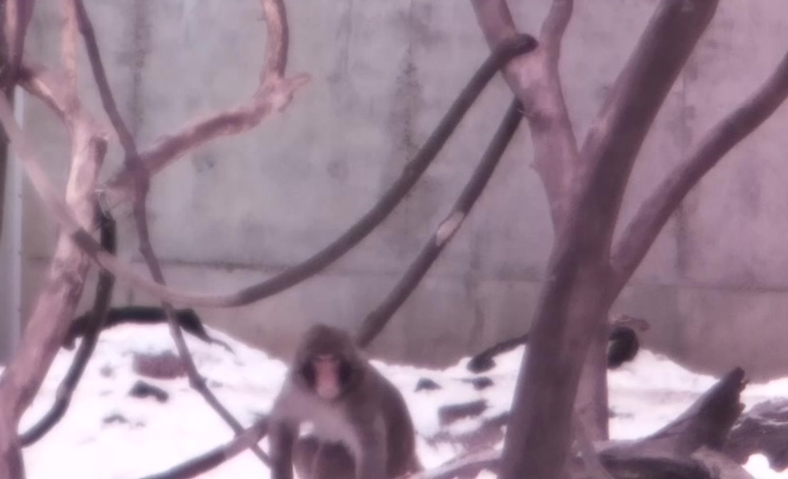
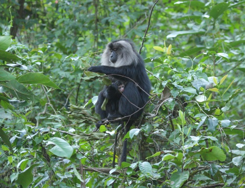
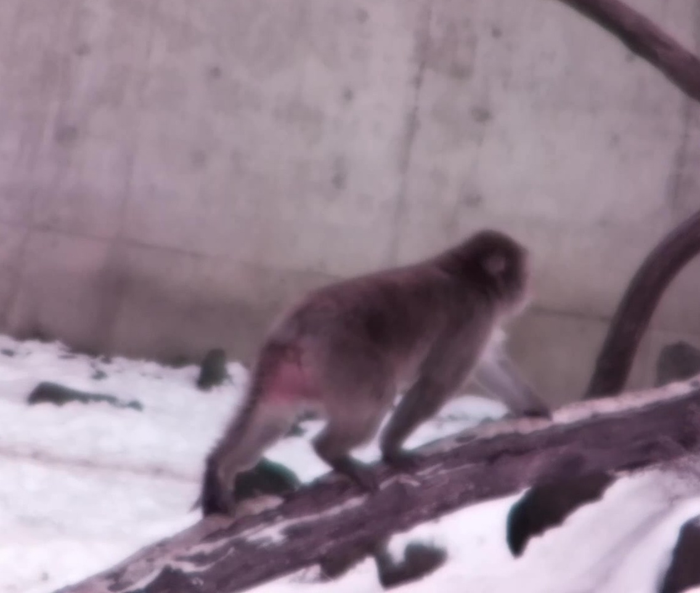
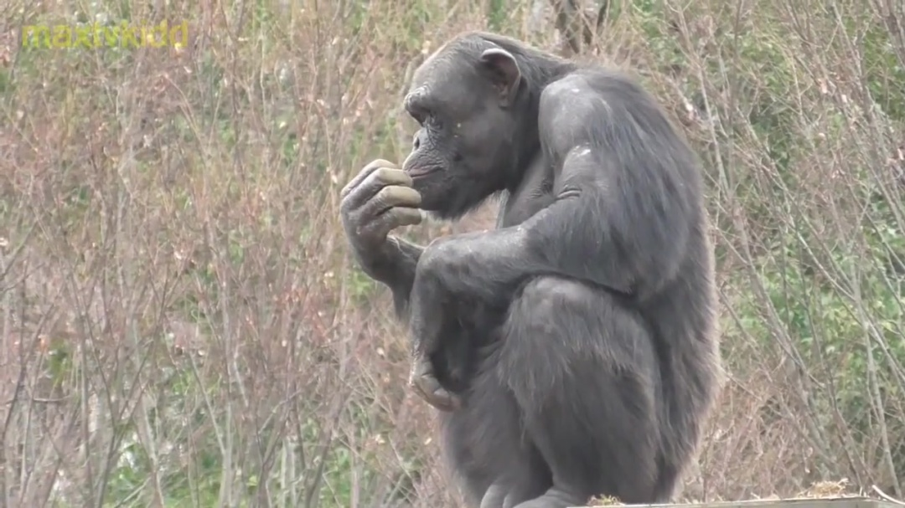

# Pose Estimation Taks

Implementation of the basic U-net architecture for pose estimation task with the data available in [this link](https://www.kaggle.com/datasets/danielchang2002/openmonkeychallenge)

  
  
  
  

## Architecture

Proposed in the medical context in 2015, has shown a good performance extracting information of images, it is compose of two parts, a downsampling phase follow by an upsampling phase, connected between the by skip conections and an bottleneck. Convolutions are the biulding block of this architecture.

{width=200}
