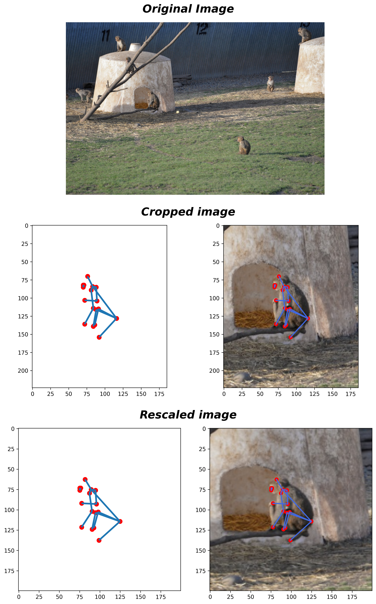
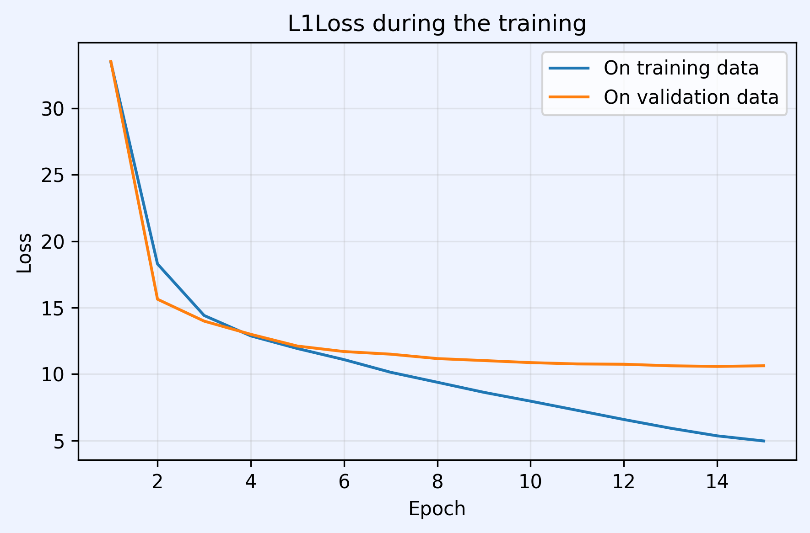
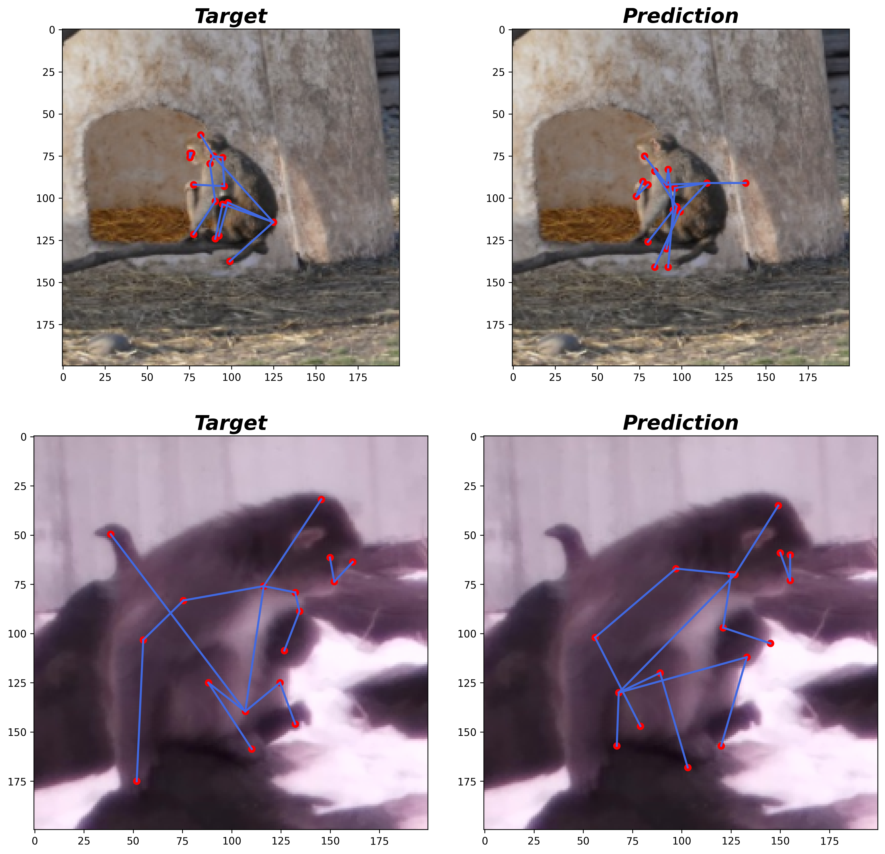

# Pose Estimation Task

Implementation of a basic U-Net architecture for a pose estimation task using the data available at [this link](https://www.kaggle.com/datasets/danielchang2002/openmonkeychallenge).

  
  
  
  

---

## Architecture

Originally proposed for medical imaging in 2015, U-Net has demonstrated strong performance in extracting structured information from images. The architecture consists of two main components: a downsampling path followed by an upsampling path, connected through skip connections and a bottleneck. Convolutional layers are the fundamental building blocks of this architecture.

In this implementation, we used the same number of channels throughout the network, except for the first layer because the input images contain three channels. Additionally, we added a feed-forward neural network at the end to generate the final predictions.

   
  
    Source: Ronneberger et al., 2015 — U-Net: Convolutional Networks for Biomedical Image Segmentation
  

---

## Data

The dataset used to train our model was released for the competition [OpenMonkeyChallenge](https://competitions.codalab.org/competitions/34342) in 2021. It consists of images divided into training (66,917), validation (22,306), and test (22,306) sets. The training and validation subsets include annotations for each image containing the target landmarks.

**NOTE:** We did not perform hyperparameter fine-tuning in order to present the U-Net architecture in the simplest possible way. Therefore, model evaluation was conducted using the validation set.

---

## Preprocessing

As shown in the images above, the dataset contains images with varying dimensions, perspectives, and resolutions. Therefore, preprocessing is required to standardize the input format. The applied transformations are as follows:

First, we crop each image so that the monkey is centered and occupies most of the frame. For this purpose, we use the bounding box values provided in the annotations. Each bounding box consists of four numeric values representing the coordinates of two points that define the region containing the monkey. The landmark coordinates are adjusted accordingly after cropping.

Second, after cropping, the images are resized to a fixed resolution of 200×200 pixels in order to be compatible with the model input. The landmark coordinates are scaled accordingly.

  

---

## Reviewing the Trained Model

The following plot shows that the model not only learned to predict landmarks on the training dataset, but also discovered useful patterns that allow it to predict landmarks on unseen data.

  

---

## Results

Although the predictions on unseen data are not perfect, they are coherent and closely approximate the true landmark positions. Considering that no hyperparameter fine-tuning was performed and the model was trained for only 15 epochs, the results are encouraging.

  

